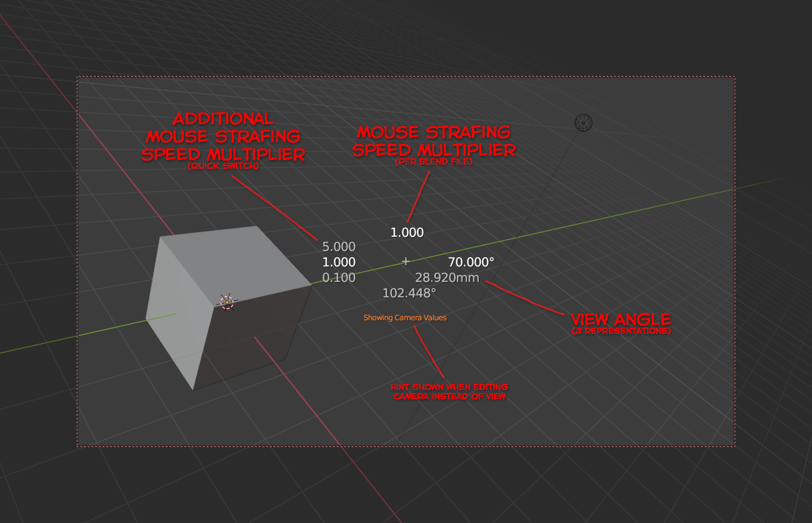
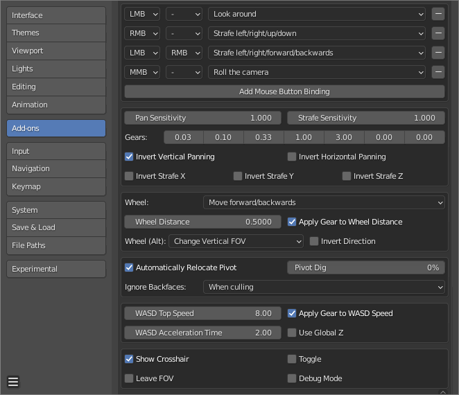

# Mouse Strafing
Strafe in Blender's 3D View using the mouse, while holding down a key. Navigate large scenes faster. Maneuver through the cracks.

## Some visual stimuli to grab your attention
It's hard to show off something that doesn't have much to look at and only really helps you with moving the camera around.

This overlay information is only displayed when changing view properties while using mouse strafing navigation.

### Addon preferences

# Installation
1. In Blender, find a key you want to use for *mouse strafing navigation*. In the following we assume you use `spacebar` (usually requires to unbind animation playback from it first; perhaps Toolbox (`Shift + spacebar`) as well).
    * As an alternative, side mouse buttons may be a good fit, if available.
2. Download the latest `mouse_strafing.zip` from the [Releases page](https://github.com/Zyl9393/mouse_strafing/releases) and install it from the Blender Addons preferences page; minimum Blender version is `2.93`.
3. Check in the addon's preferences that your mapped key is not in conflict with any other keys.

# How to use
This section assumes you set the addon up as described above and have default keymap settings and addon preferences.  
**Any key bindings mentioned only function while being in mouse strafing navigation.**

## Mouse Strafing Navigation
In the 3D View, press and hold `spacebar` to enter mouse strafing navigation. A crosshair will appear in the center of the screen. Click and hold the `left, right or middle mouse button` (`LMB`, `RMB`, `MMB`) to enable pannig and various mouse strafing behaviors. Additionally, you can hold the `both the left and right mouse button` (`BMB`) together for a 4th movement option. Then, move the mouse to strafe or turn. Release `spacebar` to end navigation. Which buttons do what can be configured in the addon preferences.

## Speed adjustment
Hold `Shift` to move at 500% speed. Hold `Alt` to move at 20% speed (50% for pan and roll sensitivity).  
You can specify additional speed multipliers ("Gears") in the addon preferences through which you can cycle by pressing `G` or `Shift + G`.  
You can also configure `mouse wheel` to change mouse strafe sensitivity (instead of moving the camera) in the addon preferences.

## Relocate Pivot
You can press `Shift + C` to toggle automatic pivot relocation on/off (defaults to being on). When enabled, it relocates the view pivot automatically every time you exit mouse strafing navigation. When turning it on, the crosshair will signal this by briefly turning yellow (red when turning off) for the duration of you holding the key.
Pressing only `C` disables automatic pivot relocation if it is enabled to give you manual control and relocate the 3D View's pivot point to the surface which you are currently looking at with the crosshair. The crosshair will turn green on success; red on failure. When backface culling is enabled, backfaces will be ignored; this behavior can be changed in the addon preferences.  

## Save states
Tap one of the number keys (`0`-`9`) to save the current view state to that number. Tap a number twice (within 1 second) to instead load its last saved view. You can also press `T` and then a number key to load.

## Change Field of View
Use `Ctrl + mouse wheel` to change the field of view. The manner in which the field of view is modified (horizontal angle, vertical angle or focal length) and more can be changed under addon preferences.

## Lock camera to view
Blender's lock camera to view option is treated by the addon as you would expect. When enabled, you can press `0` on num block to view the render camera and then move it around using mouse strafing navigation. This will record undo events for the camera.

## Reset Roll
Press `R` to reset camera roll.

## WASD
Just as with the Fly Operator, you can use `WASD` (and `Q` and `E`) to move and strafe with the keyboard.
