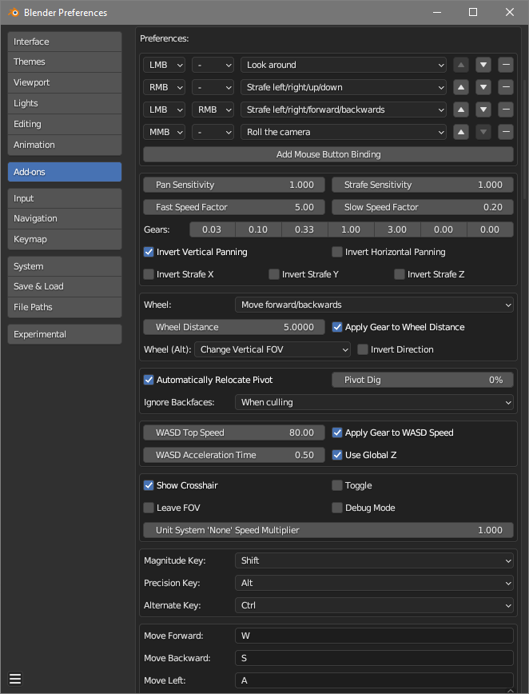

# Mouse Strafing
Strafe in Blender's 3D View using the mouse, while holding down a key. Useful for navigating large scenes faster.

## Overlay UI

This overlay information is only displayed while you are changing view properties.

## Addon preferences

# Installation
1. In Blender, find a key you want to use for the mouse strafing mode. I prefer spacebar (usually requires to unbind animation playback from it first).
2. Download the latest `mouse_strafing.zip` from the [Releases page](https://github.com/Zyl9393/mouse_strafing/releases) and install it from the Blender Addons preferences page.
3. Check in the addon's preferences that your mapped key is not in conflict with any other keys.

# How to use

This section assumes you set the addon up as described above.

## Navigation
In the 3D View, press and hold the spacebar. A cross will appear in the center of the screen. Click and hold the left, right or middle mouse button to enable pannig and mouse strafing. Additionally, hold the left and right mouse button together for a 4th movement option. Then move the mouse to strafe or turn. Which buttons do what can be configured in the addon preferences.

## Relocate Pivot
While holding the spacebar, press C to relocate the 3D View's pivot point to the surface which you are looking at. When backface culling is enabled, backfaces will be ignored.  
You can hold C for one second to toggle automic pivot relocation on and off.

## Save states
While holding the spacebar, tap one of the number keys (0-9) to save current view to that number. Tap a number twice (within 1 second) to instead load its last saved view.

## Change Field of View
Use the scroll wheel to change the field of view or move a set distance. (See preferences)
* Mouse wheel for field of view.

## Reset Roll
While holding the spacebar, press R to reset view camera roll.

## Speed adjustment
Hold the Shift key to go 5 times faster. Hold the Ctrl key to go 5 times slower. For panning, you can reduce the speed by pressing Alt. Hold Ctrl and Alt at the same time to go at only 2% speed.
* Alt + mouse wheel for base strafing speed.
* G and Shift+G to cycle "gears" (additional strafing speed multiplier).

## WASD
Just as with the Fly Operator, you can use WASD (and Q and E) to move and strafe with the keyboard.
