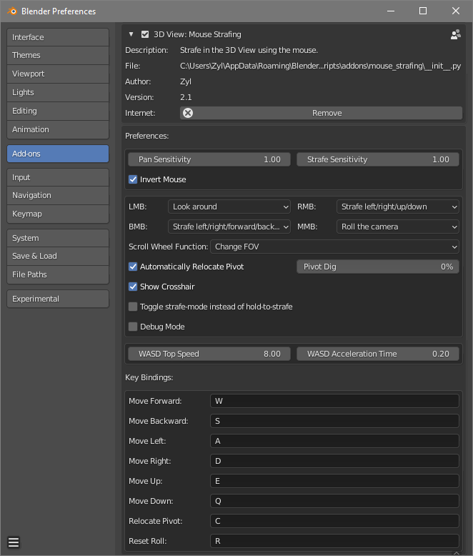

# Mouse Strafing
Strafe in Blender's 3D View using the mouse, while holding down a key. Useful for navigating large scenes faster.

## What does it look like?
See [preview.webm](https://raw.githubusercontent.com/Zyl9393/mouse_strafing/master/preview.webm).

Addon preferences:

# Installation
## For the tech-savvy
1. Clone this repository.
2. Run `package.bat`, which bundles the project in `mouse_strafing.zip`.
3. In Blender, unbind animation playback from the spacebar.
4. Install `mouse_strafing.zip` from the Blender Addons preferences page.

## For everyone else
1. In Blender, unbind animation playback from the spacebar.
2. Download [mouse_strafing.zip](https://github.com/Zyl9393/mouse_strafing/raw/master/mouse_strafing.zip) and install it from the Blender Addons preferences page.

## But I don't want to change what I have on the spacebar
Not a problem. You can change the binding in the preferences if you feel you have found a more suitable configuration for your workflow.

# Usage
## Strafing
In the 3D View, press and hold the spacebar. A cross will appear in the center of the screen. Click and hold the left, right or middle mouse button to enable mouse strafing. Additionally, hold the left and right mouse button together for a 4th movement option. Then use the mouse to strafe or turn. Which buttons do what can be configured in the addon preferences.

## Relocate Pivot
While holding the spacebar, press C to relocate the 3D View's pivot point to the surface which you are looking at.

## WASD
Just as with the Fly Operator, you can use WASD to move and strafe with the keyboard.

## Speed adjustment
Hold the Shift key to go 5 times faster. Hold the Ctrl or Alt key to go 5 times slower. For turning, only going slower with Ctrl or Alt will be respected.
